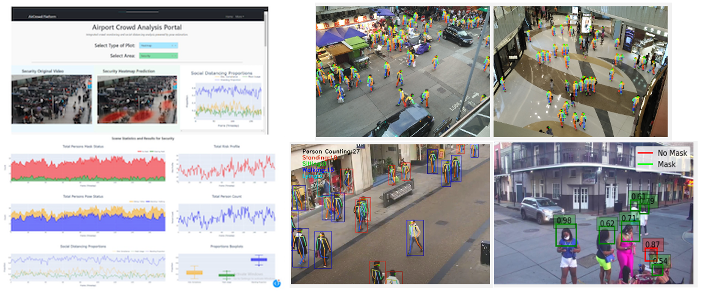

## Hey! 👋

I'm Ben, a Aerospace Engineer (Avionics, Electronic and Electrical Systems) and Data Science Practitioner. 

I have a specialist focus on Applied AI techniques, Machine Learning and Data Science Technologies. My experience in software, data science and programming extends over a decade, with expertise developed on a range of professional and personal projects in that time. I love working with technology, learning new skills, and working across a variety of programming languages. Currently my main efforts focus around Python-based development.

## Some past projects:

#### Integrated Crowd-Monitoring and Social Distancing Platform

Development of an **Integrated Crowd-Monitoring and Social Distancing Platform** that exploits video surveillance data and novel comuter-vision techniques. Application of Deep Computer Vision, including Crowd-Pose Estimation, Object Detection, Target Tracking and Automated Homography. Research published through MFI2022 conference. Source code available: https://github.com/BenjaminFraser/Social-Distancing-Pose-Platform.

	

#### Digital-Twin based Novelty Detection Framework for Unmanned Aerial Systems

Development of a **Digital-Twin based Novelty Detection Framework for Unmanned Aerial Systems**, through the application of Deep Unsupervised Learning (Autoencoder-based) techniques. Published through IEEE as part of DASC2021 conference: https://ieeexplore.ieee.org/document/9594321/.

#### Multi-Modal Text (NLP) and Tabular Classification Framework

A NLP application that develops a **Multi-Modal Text (NLP) and Tabular Classification Framework** to help analysts streamline the process of performing reviews on incoming applications. Developed as part of an MVP product to enhance the productivity within a key MoD governmental department. Application of classical and deep ML techniques in Tensorflow, with a focus on Natural Language Processing.

#### Object Detection Framework for Satellite Imagery

Development of an **Object Detection framework for the detection and classification of objects within satellite imagery**, with a focus on Defence context. This included an end-to-end framework developed in PyTorch, with a custom-tuned Faster-RCNN architecture to work with satellite based imagery. Key features included a bespoke preprocessing phase that better prepared satellite imagery objects for classification through tiling and data-augmentation.

#### Object Detection for Analysis of Human Mask Usage

Development of an **Object Detection Model for the analysis of Face Mask usage within complex scenes**. Built using a Faster RCNN object detector fine-tuned in PyTorch using a custom mask object detection dataset, with a focus on complex scenes that are representative of real world applications and camera surveillance feeds. Once the model was trained and optimised for the task, an inference dashboard was developed in Dash to allow new predictions to be made on selected images. Source code and project summary available at: https://github.com/BenjaminFraser/Mask-Object-Detection. 

	

#### Image Classification Web Application

An **Image Classification Web Application**, built using Flask, Bootstrap and JS to allow for the uploading of a given image that is subsequently classified. The preparation and formation of a deep convolutional network model was performed, making use of transfer-learning and fine-tuning of the Inception architecture. The application will classify images according to the specific transfer learning task carried out (the app was demonstrated with different dog breeds). Source code available at: https://github.com/BenjaminFraser/Dog-Breed-Classifier-App.

	

#### Digital Electronic and Control Engineering Desk GUI Application

A **Python GUI application that uses Tkinter, matplotlib, numpy, scipy and other scientific computing libraries to provide classical and digital electronic and control engineering functions for graphical analysis**. Developed whilst conducting a BSc in Electronics Systems Engineering, to support cohorts (and wider electronic engineering community via GitHub) in forming control engineering plots and visualisations. Available at: https://github.com/BenjaminFraser/Control_engineering_apps. 

	

## My Education

### Master of Science (MSc.), Applied Artificial Intelligence

*Centre for Autonomous and Cyber-Physical Systems, Cranfield University, United Kingdom.*

Topics included Statistical Learning, Deep Learning, Computer Vision, Search & Optimisation, Intelligent Agents, Bayesian Techniques, Systems Engineering, Coding and Development (Python & MATLAB), Data Visualisation and Analytics, Reinforcement Learning, AI Research. Publication of multiple formal papers in the field of Applied-AI through the IEEE. Presentation of research at two international technology conferences.

### Bachelor of Engineering (Honours), General Engineering and Engineering Design

*Open University, Milton Keynes, United Kingdom.*

Final dissertation on Stress Mechanics and Design included multi-dimensional Finite Element Analysis (FEA), with application of scientific and numerical computing in Python.

### Bachelor of Science (BSc.), Electronic Systems Engineering

*University of Portsmouth, United Kingdom*

Two major projects undertaken, including an electronic system design, and an aviation system research project based on Electronic Warfare and Infrared Missile technologies.

## Contact / Collaborate:

📫 You can find me on [Twitter](https://twitter.com/BenFraser613) or [LinkedIn](https://www.linkedin.com/in/ben-fraser613).